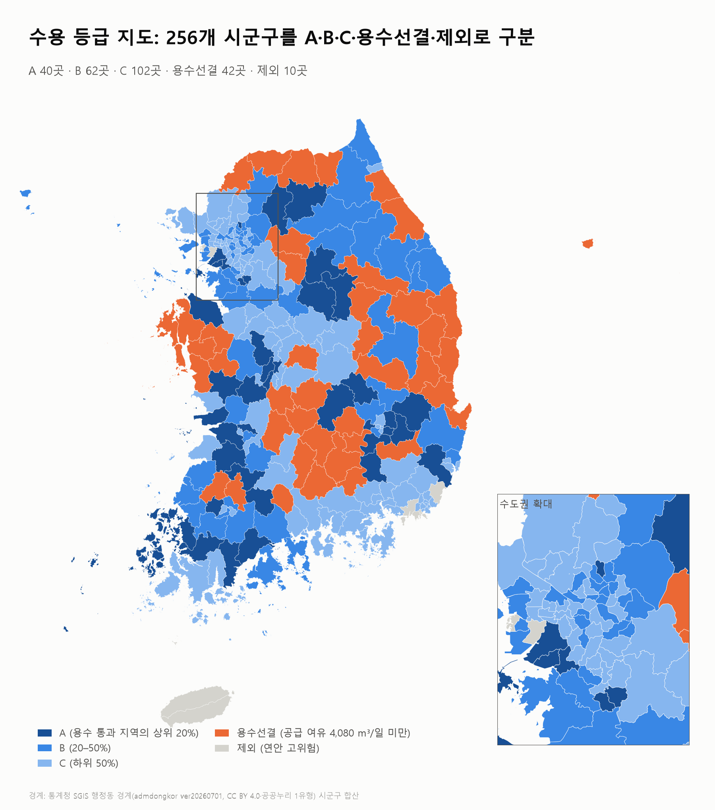

# AI 데이터센터 시군구 수용 진단 (kdata-datarecipe)

2026 데이터+AI 혁신 챌린지 데이터 문제해결 부문 · **데이터레시피** 제안 프로젝트의 팀 저장소입니다.

> 전국 256개 시군구(2026년 행정구역)가 **1GW급 AI 데이터센터를 수용할 수 있는지** 전력·신재생·수자원·재해·냉각 5개 공공데이터 피처로 같은 기준에서 진단하고, 지역별 **수용 점수·등급·보강 항목**을 제시합니다.

이 문서는 레시피 입력 화면(분류정보, 개요, 활용 가능 데이터셋, 분석 프로세스, 결과 예시, 예상 성과)을 채우는 데 필요한 프로젝트 내용을 정리한 것입니다. 데이터 출처·재현 명령·검수 기록은 [`docs/데이터출처_재현_검수.md`](docs/데이터출처_재현_검수.md)에 있습니다.

## 1. 한눈에 보기

| 항목 | 내용 |
|---|---|
| 분석 단위 | 전국 256개 시군구(구가 있는 시는 구 단위, 2026년 개편 신설 구 포함), 시군구코드 5자리 |
| 진단 대상 | 1GW급 AI 데이터센터(정부 AIDC 메가프로젝트의 부지 단위 0.5~1GW) |
| 입력 피처 | 전력, 신재생, 수자원, 재해, 냉각 5개(모두 공공데이터) |
| 결합 방법 | 피처별 0~1 점수화 → 논문 AHP 가중치로 가중합(데이터레시피: 통계 분석·점수화 중심) |
| 산출물 | 시군구별 수용 점수(타겟 `suitability_score`), 등급, 보강 항목 |
| 결과 요약 | A 40곳 · B 62곳 · C 102곳 · 용수선결 42곳 · 제외 10곳 |
| 제출용 파일 | [`recipe/`](recipe/) 데이터셋 · 컬럼정의 · 템플릿 예시 · 결과 이미지 5장 |

## 2. 배경과 문제 (이 레시피가 필요한 이유)

- **수요는 급증하는데 입지 판단 기준이 없습니다.** 정부는 2026년 6월 29일 AI 데이터센터(AIDC)를 3대 메가프로젝트에 포함해 2029년 8.4GW, 2035년 18.4GW 구축을 추진합니다. 부지 하나가 0.5~1GW이고 1GW에 30만 평 이상이 필요한 초대형 시설이라 전력·용수·재해 조건을 갖춘 지역을 가려내는 일이 사업 성패를 좌우합니다([메가프로젝트 18.4GW](https://www.dt.co.kr/article/12075445), [AIDC 3곳 확정, 1GW 30만평](https://edaily.co.kr/News/Read?mediaCodeNo=257&newsId=03742486645514192)).
- **지자체가 자기 지역의 수용 수준을 점검할 공통 기준이 없습니다.** 1GW 하루 용수 추정치만 정부 약 400톤, 국회 약 2만 6천 톤으로 65배 차이가 날 만큼 공식 기준이 없습니다(보도 기준, [서플](https://supple.kr/news/cmsxoll7b004a66gib4vw5rcm)). 발표된 18.4GW 중 고객이 확정된 규모가 일부라는 지적도 있어, 같은 정보 없이 유치 경쟁에 나서면 인프라에 선제 투자한 지역이 부담을 떠안을 수 있습니다.
- **선행연구는 요인의 중요도까지만 밝혔습니다.** 이기수·정준호(2026, Fuzzy-AHP 입지요인 중요도, 전문가 유효 응답 28부)는 전력계통과 냉각환경이 가장 중요한 요인임을 보였고, 지역별 객관지표를 결합해 후보지별 적합성을 비교하는 일은 후속 과제로 남겼습니다.
- **수용 여건의 상당 부분은 공공데이터로 확인할 수 있습니다.** 변전소 여유(한국전력), 재생에너지 발전량(한국에너지공단), 지진·홍수·산사태·산불·연안 위험, 시간별 기온·습도(기상청), 정수장 공급 여유(상수도통계)를 시군구 단위로 같은 기준에 놓고 비교하면 어느 지역에 무엇이 부족한지 보입니다.

## 3. 분석 목적과 목표

**목적:** 전국 시군구가 1GW급 AI 데이터센터를 수용할 수 있는 수준을 같은 기준으로 진단하고, 지역별 병목(보강이 필요한 항목)을 도출합니다.

**측정 가능한 목표**
1. 256개 시군구 전부에 5개 피처 값을 같은 기준으로 산출합니다.
2. 시군구별 수용 점수를 산출해 A·B·C·용수선결·제외로 분류합니다.
3. 등급이 낮은 지역의 보강 항목(전력, 용수, 신재생, 재해, 냉각)을 지역별로 제시합니다.

**활용 대상:** 지자체(산업·에너지 담당)가 중심이고, 정부와 데이터센터 사업자가 후보지 1차 점검에 보조적으로 씁니다.

## 4. 분석 방법

### 피처 5개

| 피처 | 원천 데이터 | 점수에 쓰는 값 |
|---|---|---|
| 전력 | 한국전력 변전소 접속 여유(2029년 기준) | 단일 변전소 접속 가능 여유 최댓값(MW) |
| 신재생 | 한국에너지공단 기초지자체별 보급 현황(2024) | 재생에너지 발전량(MWh), log(1+x) |
| 수자원 | 환경부 상수도통계(2024) | 최대급수일 물 공급 여유(m³/일), log(1+H) |
| 재해 | 지진·홍수·산사태·산불·연안 위험 | 안전도 = 1 − 4개 재해 점수의 가중합 |
| 냉각 | 기상청 ASOS·AWS 시간별 기온·습도(2024~2025) | 습구온도 12.8℃ 이하 시간의 비율(외기 냉각 가능 시간) |

### 가중치

논문의 AHP 종합중요도를 5개 피처에 맞춰 비율을 다시 맞췄습니다. 회귀로 가중치를 구하지 않은 이유는 기존 데이터센터 입지가 수도권 집중 같은 과거 산업구조를 반영하고, 입지하지 않은 이유(투자계획 부재 등)를 조건 부족과 구분할 수 없기 때문입니다.

| 전력 | 신재생 | 수자원 | 재해 | 냉각 |
|---|---|---|---|---|
| 41.75% | 19.22% | 16.39% | 12.97% | 9.68% |

### 점수와 등급 규칙

- 피처마다 후보제외를 뺀 246곳 안에서 0~1로 정규화하고(클수록 유리) 가중합해 **수용 점수**를 냅니다.
- **후보제외 10곳:** 연안 고위험(CO Red).
- **용수선결:** 물 공급 여유가 1GW 데이터센터의 하루 물 수요 기준값 **4,080 m³/일**(1GW × 24h × 공랭 WUE 0.17 L/kWh)보다 작은 지역. 기준값에 공식 값이 없어 400톤과 33,840톤의 민감도를 함께 확인했습니다.
- **판정보류:** 피처 값이 비어 있는 지역은 등급을 매기지 않는 규칙이며, 현재 데이터에는 해당 지역이 없습니다.
- **A·B·C:** 용수 기준을 통과한 지역 안에서 상위 20% / 20~50% / 하위 50%.
- **보강 항목:** 전력 여유 0MW 또는 하위 25%, 용수 공급 여유 미달, 신재생·재해·냉각 하위 25%.

## 5. 분석 프로세스 (레시피 STEP 제안, 최대 6단계)

| STEP | 이름(8자 이내 제안) | 내용 |
|---|---|---|
| 1 | 데이터 수집 | 전력·신재생·수자원·재해·냉각 5개 공공데이터를 내려받고 출처·기준연도를 정리 |
| 2 | 기준 통합 | 2026년 행정구역 256개 시군구를 기준행으로, 시군구코드 5자리로 1:1 병합 |
| 3 | 피처 산출 | 피처별 원값 계산(변전소 여유, 발전량, 공급 여유, 재해 점수, 외기 냉각 시간 비율) |
| 4 | 점수 정규화 | 평가 대상 246곳 안에서 0~1 점수화(수자원·신재생은 로그 변환) |
| 5 | 가중합·등급 | AHP 가중치로 수용 점수 산출, 용수 기준·분위로 등급과 보강 항목 판정 |
| 6 | 검증 | 정부 확정 부지와 비교하고 가중치·기준값을 바꿔 민감도 확인 |

## 6. 주요 결과

수용 점수는 0.147~0.819입니다(후보제외 10곳 제외).

- **상위 지역:** 신안군(0.819), 안산 단원구, 경산시, 군산시, 대구 동구, 안산 상록구, 오산시, 영천시, 순창군, 충주시 순입니다. 상위 20곳은 전력 점수의 기여가 가장 크고, 나머지 피처 조합은 지역마다 다릅니다.
- **전력이 가장 큰 병목입니다.** 변전소 접속 여유가 0MW인 지역이 평가 대상의 약 37%(90곳)이고, 0.5GW를 수용할 수 있는 지역은 11곳, 1GW를 수용할 수 있는 지역은 없습니다. 어디든 대규모 송전 보강이 필요하다는 뜻입니다.
- **점수가 높아도 용수가 막히는 곳이 있습니다.** 서산시(점수 전체 11위 수준)·보령시·철원군은 물 공급 여유가 기준에 못 미쳐 용수선결입니다. 용수 보강이 해결되면 상위권입니다.
- **정부 확정 부지와 비교:** 세종(30위, A)과 울산 울주군(39위, A)은 상위, 동해시(105위, B)와 울산 남구(145위, C)는 하위권입니다. 낮은 곳은 전력 여유가 작은 것(동해 90MW, 울산 남구 40MW)으로 설명되어, 보강 항목 진단이 의미 있다는 근거가 됩니다.
- **민감도:** 논문의 Fuzzy-AHP 가중치로 바꿔도 순위 상관 0.967(상위 20곳 중 19곳 동일)로 안정적입니다. 동일 가중치로 바꾸면 0.836(12곳 동일)로 달라지므로, 가중치 선택이 결과에 영향을 줍니다.

### 결과 이미지 (레시피에는 최대 5장, 이미지와 해석을 한 쌍으로)

| 이미지 | 보여주는 것 |
|---|---|
| [등급 지도](recipe/figures/fig1_grade_map.png) | 256곳의 등급 분포(수도권 확대 포함) |
| [수용 점수 지도](recipe/figures/fig2_score_map.png) | 지역별 점수의 공간 분포 |
| [피처별 점수 지도](recipe/figures/fig3_feature_maps.png) | 5개 피처가 지역마다 다름 |
| [상위 20곳 점수 구성](recipe/figures/fig4_top20_contribution.png) | 상위 지역의 피처별 기여 |
| [검증과 민감도](recipe/figures/fig5_validation_sensitivity.png) | 확정 부지 위치, 가중치 변경에 따른 순위 유지 정도 |



## 7. 활용 가능 데이터셋 (제출 파일)

| 파일 | 내용 |
|---|---|
| [`recipe/aidc_siting_dataset.csv`](recipe/aidc_siting_dataset.csv) | 최종 데이터셋 256행 × 21열 |
| [`recipe/aidc_siting_column_definition.csv`](recipe/aidc_siting_column_definition.csv) | 컬럼 정의서(변수 번호·타겟 여부·데이터 타입·컬럼명·비고) |
| [`recipe/aidc_siting_template_example.csv`](recipe/aidc_siting_template_example.csv) | 데이터 템플릿 예시(등급별 대표 5행) |

**변수 가이드라인**
- **식별:** `sigungu_code`(문자열로 읽기), `sido_name`, `sigungu_name`
- **독립변수:** 피처별 원값과 0~1 점수 — 전력 `power_substation_headroom_mw_2029`·`power_score`, 신재생 `renewable_generation_mwh_2024`·`renewable_score`, 수자원 `water_supply_headroom_m3_per_day`·`water_score`, 재해 4개 세부 점수(지진·홍수·산사태·산불)와 `disaster_safety_index`·`disaster_score`, 냉각 `cooling_free_cooling_hour_ratio`·`cooling_score`
- **종속변수(타겟):** `suitability_score`(5개 점수의 가중합, 0~1)
- **결과:** `suitability_grade`(등급), `reinforcement_needs`(보강 항목), `excluded_reason`(제외 사유)

## 8. 레시피 입력 항목별 참고

| 입력 항목 | 참고 내용 |
|---|---|
| 레시피 선택 | 데이터레시피(통계 분석 중심의 가중합 점수화) |
| 레시피명 후보 | AI 데이터센터 시군구 수용 진단: 공공데이터 5종으로 보는 1GW급 입지 여건과 보강 항목 |
| 데이터 유형 | 시군구 단위 공공 인프라·기후·재해 통계 데이터(정형) |
| 활용목적 | 입지 진단·의사결정 지원(분석모델·알고리즘 선택지는 화면에서 기초 통계 분석 계열을 고르면 됩니다) |
| 키워드 | `AI데이터센터,입지진단,시군구,전력,수자원,재해,냉각,신재생에너지,AHP,가중합` |
| 이 레시피로 얻는 것 | 시군구별 수용 점수·등급·보강 항목, 전력·용수 등 병목 지역 파악 |
| 추천 대상(3개 이내) | 지자체 산업·에너지 담당, 정부 AIDC 입지 검토 부서, 데이터센터 사업자 |
| 필요한 데이터 | 시군구별 변전소 접속 여유, 재생에너지 발전량, 정수장 공급 여유, 재해 위험 점수, 시간별 기온·습도 |
| 최소 데이터 요건 | 1행=1시군구 표, 시군구코드 기준, 5개 피처 값(결측이 있으면 해당 지역은 등급을 보류) |
| 준비 사항 | 엑셀·CSV 기록 외 별도 시스템 불필요(점수 계산은 정규화와 가중합이라 엑셀로 가능) |
| 성과 지표 후보(최대 3) | ① 256개 시군구 전체 피처 산출·등급 분류, ② 정부 확정 부지 사례와 보강 항목 진단 일치, ③ 가중치 변경(Fuzzy-AHP) 시 순위 상관 0.967 |
| 활용방안(단기) | 지자체가 자기 지역의 등급과 보강 항목을 확인해 유치 전략과 선제 투자 우선순위를 정하고, 정부·사업자가 후보지를 1차 점검 |
| 활용방안(장기) | 논문의 부지·네트워크 요인 같은 피처를 추가하고, 공공데이터 갱신 주기에 맞춰 매년 다시 계산해 지역별 변화를 추적 |

## 9. 한계와 해석 시 주의

- **확정 판정이 아닌 사전 진단입니다.** 한전과의 실제 접속 협의, 관로 용량, 취수 권리처럼 공개되지 않은 정보는 반영하지 못했습니다.
- **부지 조건 피처가 없습니다.** 1GW에는 약 30만 평이 필요한데 이를 반영하지 못해, 서울 도봉구·대구 동구 같은 도심 구가 상위에 들어갈 수 있습니다.
- **전력 변별력이 낮습니다.** 평가 대상의 약 37%(90곳)가 접속 여유 0MW로 같은 전력 점수를 받아, 이 지역들은 다른 피처가 순위를 가릅니다.
- **수자원 값은 낙관적 상한입니다.** 같은 광역 정수장을 쓰는 지역이 여유를 중복으로 셉니다. 물 수요 기준값도 공식 값이 없어 추정입니다.
- **가중치는 전문가 유효 응답 28부에 기반한 논문 값입니다.** 전력의 비중이 커서 가중치를 바꾸면 순위가 달라집니다.
- 일부 피처 값의 보완 방식과 자료 품질은 [`docs/데이터출처_재현_검수.md`](docs/데이터출처_재현_검수.md)와 [`docs/최종순위_분석과정.md`](docs/최종순위_분석과정.md)에 있습니다.

## 10. 데이터 출처

| 피처 | 출처 |
|---|---|
| 공통 | 행정안전부 행정표준코드 「법정동코드 전체자료」, 통계청 SGIS 행정동 경계(지도용) |
| 전력 | 한국전력공사 변전소·차단기 접속 여유(전력 담당 팀원 정리, 업로드 예정) |
| 신재생 | 한국에너지공단 「기초지자체별 신재생에너지 보급 현황」, 전국 태양광 발전사업 허가정보, 충청북도·고양시·성남시·화성시 허가·발전소 현황, 한전 지역별 PPA 계약현황, 한국에너지공단 풍력기 위치정보 |
| 수자원 | 환경부 「상수도 통계」 2024, 국가수도기본계획 고시문(환경부고시 제2022-187호) |
| 재해 | 재해 담당 팀원 정리(지진·홍수·산사태·산불·연안 위험), 전라남도 지방하천 현황, 인천광역시 하천 현황 |
| 냉각 | 기상청 API허브 ASOS(`kma_sfctm2`)·AWS(`awsh`) 시간자료, 기상청 관측지점정보 |
| 가중치 | 이기수·정준호(2026), Fuzzy-AHP를 이용한 국내 AI 데이터센터 입지요인의 중요도 분석 |
| 물 수요 기준값 | 한국환경연구원 WUE(공랭 0.17, 수랭 1.41) 보도 인용, [근거 정리](docs/기준값D_근거.md) |

파일별 링크·기준일은 [`docs/데이터출처_재현_검수.md`](docs/데이터출처_재현_검수.md)에 있습니다.

## 11. 저장소 구성과 재현

```
README.md              이 문서(프로젝트 개요, 레시피 작성 참고)
recipe/                레시피 제출용 파일(데이터셋, 컬럼정의, 템플릿, 결과 이미지 5장)
data/raw/              원천 데이터(받은 그대로, 기상청 시간자료만 gzip)
data/processed/        결과 데이터(피처별 결과, 최종 순위, 지도 경계)
src/                   처리 코드(경로는 저장소 기준 상대경로)
docs/                  데이터 출처·재현·검수, 최종 순위 분석 과정, 컬럼 설명서, 기준값 근거
```

```bash
pip install -r requirements.txt
python src/water/build_water_feature.py          # 수자원
python src/cooling/build_cooling_feature.py      # 냉각(약 2분)
python src/merge_features.py                     # 수자원·냉각 통합
python src/renewable/build_renewable_feature.py  # 신재생
python src/disaster/build_disaster_feature.py    # 재해(재해 담당 파일 업로드 후)
python src/ranking/build_ranking.py              # 최종 순위(전력 파일 업로드 후)
python src/recipe/build_recipe_files.py          # 제출용 데이터셋·컬럼정의·템플릿
python src/recipe/make_figures.py                # 결과 이미지
```

모든 파일은 `시군구코드`(5자리 문자열)로 연결합니다. 읽을 때 `dtype={'시군구코드': str}`, 인코딩은 `utf-8-sig`를 쓰세요. 이름으로 병합하면 서구·동구·고성군 등이 겹칩니다.
